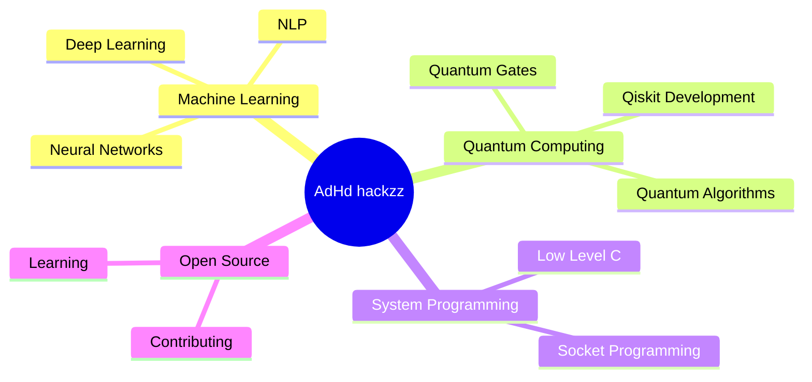

# Hi there, I'm AdHd hackzz 👋

<div align="center">
  
[](https://git.io/typing-svg)

</div>

## 🚀 About Me

```python
class AdHdHackzz:
    def __init__(self):
        self.username = "vamsz"
        self.name = "AdHd hackzz"
        self.role = "Developer | ML Enthusiast | Quantum Computing Explorer"
        self.interests = ["Machine Learning", "Quantum Computing", "Socket Programming"]
        self.currently_learning = ["Advanced ML Algorithms", "Quantum Gates", "System Design"]
        
    def say_hi(self):
        print("Thanks for dropping by! Let's build something amazing together!")

me = AdHdHackzz()
me.say_hi()
```

## 🛠️ Tech Stack

<div align="center">

### Languages


### ML/AI & Data Science


### Quantum Computing


### Tools & Technologies


</div>

## 📊 GitHub Statistics

<div align="center">
  
  
</div>

<div align="center">
  
</div>

## 📈 Contribution Graph

<div align="center">
  
</div>

## 🐍 Watch the Snake Eat My Contributions!

<div align="center">
  <picture>
    <source media="(prefers-color-scheme: dark)" srcset="https://raw.githubusercontent.com/vamsz/vamsz/output/github-contribution-grid-snake-dark.svg">
    <source media="(prefers-color-scheme: light)" srcset="https://raw.githubusercontent.com/vamsz/vamsz/output/github-contribution-grid-snake.svg">
    
  </picture>
</div>

## 🏆 GitHub Trophies

<div align="center">
  
</div>

## 💡 Featured Projects

<div align="center">

[](https://github.com/vamsz/VQF)
[](https://github.com/vamsz/ML)

[](https://github.com/vamsz/quantum_computing_python_basics)
[](https://github.com/vamsz/SOCKET_PROG-C)

</div>

## 🎯 Current Focus



## 📫 Let's Connect!

<div align="center">

[](https://github.com/vamsz)
[](https://linkedin.com/in/vamsz)
[](https://twitter.com/vamsz)
[](mailto:your.email@example.com)

</div>

## 💭 Random Dev Quote

<div align="center">


</div>

## 🎵 Spotify Playing

<div align="center">

[](https://open.spotify.com/user/YOUR_SPOTIFY_USER_ID)

</div>

## 👀 Profile Views

<div align="center">
  


</div>

---

<div align="center">
  
### 💻 "Code is like humor. When you have to explain it, it's bad." – Cory House

**⭐️ From [vamsz](https://github.com/vamsz)**

</div>
- 🔭 I’m currently working on ...
- 🌱 I’m currently learning ...
- 👯 I’m looking to collaborate on ...
- 🤔 I’m looking for help with ...
- 💬 Ask me about ...
- 📫 How to reach me: ...
- 😄 Pronouns: ...
- ⚡ Fun fact: ...
-->
